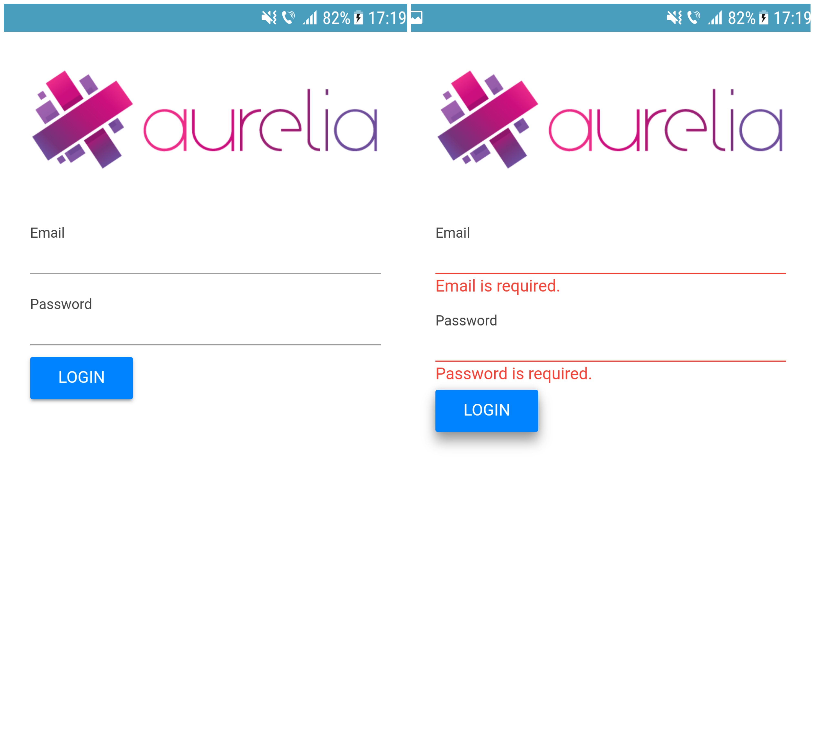

# aurelia-mobile-skeleton

Aurelia Mobile Skeleton (Aurelia, Aurelia UX, Webpack)



  |  


## Getting Started

### Initialize your environment

```shell
$ source .bash_profile
# if using zsh
$ source .zshrc
```

### Setup

```shell
$ amobile init
```

### Running in browser

```shell
$ npm start
```

- hot Module Reload

```shell
$ npm start -- webpack.server.hmr
```

### Build

```shell
npm start -- build
```

### Testing on emulator

- android

```shell
$ amobile run-android
```

- ios (to do)
```shell
$ amobile run-ios
```

## Running the tests

to do
